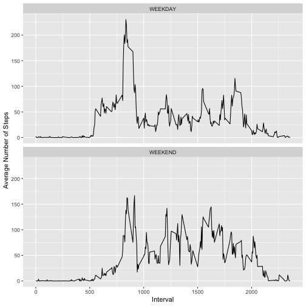

# Assignment

It is now possible to collect a large amount of data about personal movement using activity monitoring devices such as a Fitbit, Nike Fuelband, or Jawbone Up. These type of devices are part of the “quantified self” movement – a group of enthusiasts who take measurements about themselves regularly to improve their health, to find patterns in their behavior, or because they are tech geeks. But these data remain under-utilized both because the raw data are hard to obtain and there is a lack of statistical methods and software for processing and interpreting the data.

This assignment makes use of data from a personal activity monitoring device. This device collects data at 5 minute intervals through out the day. The data consists of two months of data from an anonymous individual collected during the months of October and November, 2012 and include the number of steps taken in 5 minute intervals each day.

# Data

The data for this assignment can be downloaded from the course web site:

Dataset: Activity monitoring data [52K] The variables included in this dataset are:

steps: Number of steps taking in a 5-minute interval (missing values are coded as NA)

date: The date on which the measurement was taken in YYYY-MM-DD format

interval: Identifier for the 5-minute interval in which measurement was taken

The dataset is stored in a comma-separated-value (CSV) file and there are a total of 17,568 observations in this dataset.

# Loading and preprocessing the data

Load the data (i.e. read.csv())
Process the data into a format suitable for analysis


```r
library(dplyr)
library(ggplot2)

activity_df <- read.csv("activity.csv") # read in the data
activity_df$date <- as.POSIXct(activity_df$date) # set the dates to POSIXct
```

# What is mean total number of steps taken per day?

For this part of the assignment, we can ignore the missing values in the dataset.

Calculate the total number of steps taken per day

Make a histogram of the total number of steps taken each day

Calculate and report the mean and median of the total number of steps taken per day


```r
# Calculate the total number of steps taken per day
daily_total_steps_df <- activity_df %>% 
                          group_by(date) %>%
                          summarize(total_steps = sum(steps, na.rm = TRUE))

# For an alternative implementation, see:
# https://rstudio-pubs-static.s3.amazonaws.com/76815_abf5f477ad2f43ba9bbeaa81fa7f922e.html
# daily_total_steps_df <- aggregate(activity_df$steps, by = list(activity_df$date), sum, na.rm=TRUE) 
# names(daily_total_steps_df) <- c("Date", "steps")

# Make a histogram of the total number of steps taken each day
qplot(total_steps, data = daily_total_steps_df, geom = "histogram", xlab = "Daily Number of Steps", ylab = "Count", binwidth = 300)
```


```r
#Calculate and report the mean and median of the total number of steps taken per day
mean_steps <- floor(mean(daily_total_steps_df$total_steps))
median_steps <- median(daily_total_steps_df$total_steps)
```

The mean number of steps each day is 9354  
The median number of steps each day is 10395

# What is the average daily activity pattern?

Make a time series plot of the 5-minute interval (x-axis) and the average number of steps taken, averaged across all days (y-axis)

Which 5-minute interval, on average across all the days in the dataset, contains the maximum number of steps?


```r
avg_steps_df <- activity_df %>% 
                  group_by(interval) %>% 
                  summarize(avg_steps = mean(steps, na.rm = TRUE))

ggplot(avg_steps_df, aes(x = interval, y = avg_steps)) + 
    geom_line() +
    labs(x = "Interval") +
    labs(y = "Average Number of Steps")
```


```r
# Find the 5-minute interval contains the maximum number of steps.
max_avg_steps <- avg_steps_df$interval[which.max(avg_steps_df$avg_steps)]
```
The interval with the most average steps each day is : 835

# Imputing missing values

There are a number of days/intervals where there are missing values (coded as NA). The presence of missing days may introduce bias into some calculations or summaries of the data.

Calculate and report the total number of missing values in the dataset (i.e. the total number of rows with NAs)

__Replace the missing values with the mean for that 5-minute interval.__

Create a new dataset that is equal to the original dataset but with the missing data filled in.

Make a histogram of the total number of steps taken each day and Calculate and report the mean and median total number of steps taken per day.


```r
# Find the total number of rows with NAs
num_missing_rows <- sum(is.na(activity_df$steps))
```
The total number of rows with NAs is : 2304


```r
# Create a new dataset that is equal to the original dataset but with 
# the missing data filled in.
copy_activity_df<-data.frame(activity_df)

for (r in 1:nrow(copy_activity_df)) {
  if (is.na(copy_activity_df$steps[r])) {
    value <- avg_steps_df$avg_steps[copy_activity_df$interval[r] == avg_steps_df$interval]
    copy_activity_df$steps[r] <- value
  }
}

# Calculate the total number of steps taken per day with the new dataset.
copy_daily_total_steps_df <- copy_activity_df %>% 
                               group_by(date) %>%
                               summarize(total_steps = sum(steps, na.rm = TRUE))

# Make a histogram of the total number of steps taken each day.
qplot(total_steps, data = copy_daily_total_steps_df, geom = "histogram", xlab = "Daily Number of Steps", ylab = "Count", binwidth = 300)
```


```r
#Calculate and report the mean and median of the total number of steps taken per day
copy_mean_steps <- as.integer(mean(copy_daily_total_steps_df$total_steps))
copy_median_steps <- as.integer(median(copy_daily_total_steps_df$total_steps))
```
The mean number of steps each day is 10766  
The median number of steps each day is 10766

Do these values differ from the estimates from the first part of the assignment?  
__Both mean and median have increased.__

What is the impact of imputing missing data on the estimates of the total daily number of steps?  
__The impact is that mean and median are both the same.__


# Are there differences in activity patterns between weekdays and weekends?

Use the dataset with the filled-in missing values for this part.

Create a new factor variable in the dataset with two levels – “weekday” and “weekend” indicating whether a given date is a weekday or weekend day.

Make a panel plot containing a time series plot (i.e. type = “l”) of the 5-minute interval (x-axis) and the average number of steps taken, averaged across all weekday days or weekend days (y-axis).


```r
# Create a new factor variable in the dataset with two levels – “weekday” 
# and “weekend”.
copy_activity_df$weekday <- factor(ifelse(grepl("S(at|un)", weekdays(copy_activity_df$date, abbreviate=TRUE)), "WEEKEND", "WEEKDAY"))

# Calculate the 5-minute interval (x-axis) and the average number of steps 
# taken, averaged across all weekday days or weekend days (y-axis).
#
copy_avg_steps_df <- aggregate(steps ~ interval + weekday, data=copy_activity_df, FUN=mean, na.rm=TRUE)
names(copy_avg_steps_df) <- c("interval", "weekday", "avg_steps")

# Make the panel plot.
ggplot(copy_avg_steps_df, aes(x = interval, y = avg_steps)) + geom_line() + 
         facet_wrap(. ~ weekday, nrow = 2, ncol = 1) +
         labs(x = "Interval") +
         labs(y = "Average Number of Steps")
```


